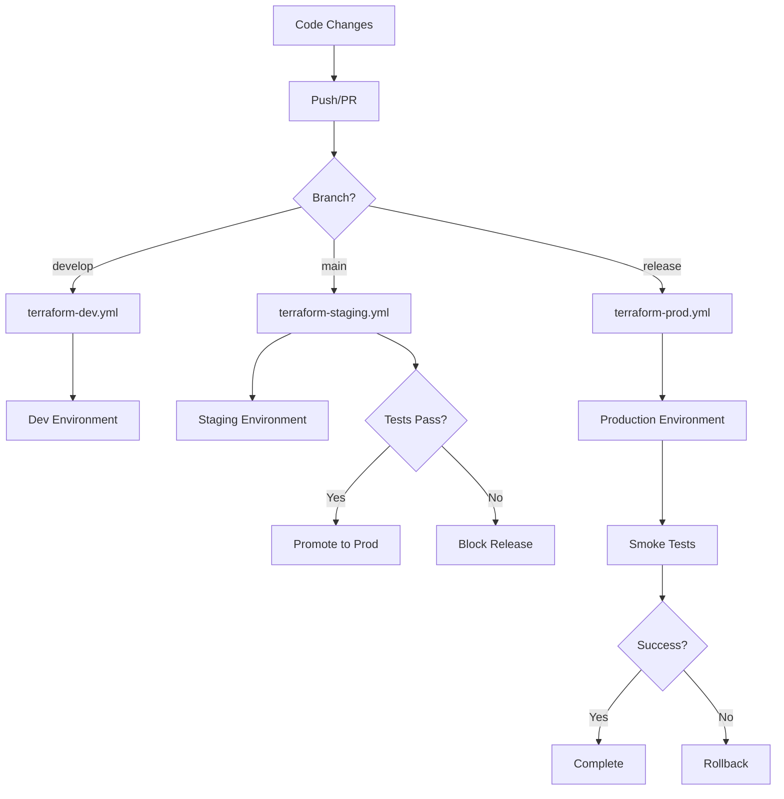

# Terraform Reusable Workflows Documentation

## Overview

This repository implements a comprehensive reusable workflow system for Terraform infrastructure management across multiple environments with release-based deployment strategies.

## Workflow Architecture

### 1. Reusable Base Workflow (`terraform-reusable.yml`)

**Purpose**: Core Terraform operations that can be reused across environments
**Features**:
- Environment-specific configuration
- Configurable Terraform version
- AWS credentials management
- Plan/Apply/Destroy operations
- Security scanning integration
- Artifact management
- PR commenting for plan output

**Key Inputs**:
- `environment`: Target environment (dev, staging, prod)
- `terraform_version`: Terraform version to use
- `working_directory`: Path to Terraform configuration
- `auto_apply`: Whether to automatically apply changes
- `destroy_mode`: Whether to destroy infrastructure
- `var_file`: Path to terraform.tfvars file

### 2. Environment-Specific Workflows

#### Development (`terraform-dev.yml`)
- **Triggers**: Push/PR to `develop` branch, feature branches
- **Auto-apply**: Only on push to `develop`
- **Features**: Slack notifications, fast feedback loop
- **Security**: Standard validation and formatting

#### Staging (`terraform-staging.yml`)
- **Triggers**: Push to `main`, release pre-releases
- **Auto-apply**: On releases and main branch pushes
- **Features**: Integration tests, promotion to production
- **Security**: Enhanced validation, integration testing

#### Production (`terraform-prod.yml`)
- **Triggers**: Release events, manual workflow dispatch
- **Auto-apply**: Only after manual confirmation
- **Features**: Security scanning, smoke tests, rollback procedures
- **Security**: Checkov security scans, manual approval gates

### 3. Infrastructure Cleanup (`terraform-destroy.yml`)

**Purpose**: Safe infrastructure destruction for non-production environments
**Features**:
- Manual confirmation required (`DESTROY` input)
- Prevents production destruction
- Audit trail with GitHub issues
- Notification system

### 4. Orchestrator Workflow (`terraform.yml`)

**Purpose**: Intelligent routing of deployments based on changed files
**Features**:
- Path-based change detection
- Conditional workflow triggering
- Deployment summary reporting
- Branch-based environment targeting

## Deployment Flow



## Environment Strategy

### Development
- **Purpose**: Feature development and testing
- **Auto-deployment**: On push to develop
- **Destruction**: Allowed via cleanup workflow
- **Approval**: None required

### Staging
- **Purpose**: Pre-production testing and validation
- **Auto-deployment**: On release pre-release
- **Destruction**: Allowed via cleanup workflow
- **Approval**: None required for staging

### Production
- **Purpose**: Live production environment
- **Auto-deployment**: On full release or manual trigger
- **Destruction**: Not allowed via automation
- **Approval**: Manual confirmation required

## Security Features

### 1. Static Security Scanning
- Checkov integration for Terraform security analysis
- SARIF output for GitHub Security tab
- Automated vulnerability detection

### 2. Access Control
- Environment-specific secrets
- OIDC integration support
- Least privilege access principles

### 3. Approval Gates
- Manual confirmation for production
- Environment protection rules
- Audit logging

## Monitoring & Notifications

### 1. Slack Integration
- Environment-specific channels
- Deployment status notifications
- Failure alerts

### 2. GitHub Integration
- Deployment status tracking
- Issue creation for incidents
- PR comments with plan output

### 3. Artifact Management
- Terraform plan artifacts (30 days)
- State file backups (90 days)
- Deployment history tracking

## Configuration Requirements

### GitHub Secrets
```yaml
# AWS Credentials
AWS_ACCESS_KEY_ID: "Your AWS Access Key"
AWS_SECRET_ACCESS_KEY: "Your AWS Secret Key"

# Optional: Slack Integration
SLACK_WEBHOOK_URL: "Your Slack webhook URL"
```

### Environment Files
Each environment requires:
- `terraform.tfvars` - Environment-specific variables
- Backend configuration for remote state
- Environment-specific variable definitions

### Repository Structure
```
.github/workflows/
├── terraform-reusable.yml    # Base reusable workflow
├── terraform-dev.yml         # Development environment
├── terraform-staging.yml     # Staging environment
├── terraform-prod.yml        # Production environment
├── terraform-destroy.yml     # Cleanup operations
└── terraform.yml             # Main orchestrator

infrastructure/
├── environments/
│   ├── dev/
│   ├── staging/
│   └── prod/
└── modules/
```

## Usage Examples

### 1. Feature Development
```bash
git checkout -b feature/new-infrastructure
# Make changes to infrastructure/environments/dev/
git push origin feature/new-infrastructure
# Creates PR → triggers terraform-dev.yml → deploys to dev
```

### 2. Staging Deployment
```bash
git checkout main
git merge develop
git push origin main
# Triggers terraform-staging.yml → deploys to staging → runs tests
```

### 3. Production Release
```bash
gh release create v1.2.3 --prerelease
# Triggers terraform-staging.yml → staging deployment + tests
# If tests pass, promote to full release
gh release edit v1.2.3 --prerelease=false
# Triggers terraform-prod.yml → production deployment
```

### 4. Environment Cleanup
- Go to Actions tab
- Run "Infrastructure Cleanup" workflow
- Select environment (dev/staging)
- Type "DESTROY" to confirm
- Provide reason for destruction

## Best Practices

### 1. Branch Strategy
- `develop`: Active development, auto-deploys to dev
- `main`: Stable code, auto-deploys to staging
- `release/*`: Release candidates
- Feature branches: PR-based validation

### 2. Release Management
- Use semantic versioning (v1.2.3)
- Pre-releases for staging validation
- Full releases for production deployment

### 3. Security
- Regular dependency updates
- Security scanning on all changes
- Environment isolation
- Secrets rotation

### 4. Monitoring
- Monitor deployment success rates
- Track infrastructure drift
- Regular security audits
- Cost optimization reviews

## Troubleshooting

### Common Issues

1. **Terraform State Lock**: 
   - Check for concurrent runs
   - Manually unlock if needed
   - Verify backend configuration

2. **AWS Permissions**:
   - Verify IAM roles and policies
   - Check regional restrictions
   - Validate credential rotation

3. **Workflow Failures**:
   - Check artifact uploads
   - Verify environment variables
   - Review Terraform plan output

### Recovery Procedures

1. **Failed Production Deployment**:
   - Automatic rollback triggers
   - Manual intervention procedures
   - Incident response protocols

2. **State File Corruption**:
   - Restore from artifacts
   - Manual state recovery
   - Backup validation

## Maintenance

### Regular Tasks
- Update Terraform versions
- Rotate AWS credentials
- Review and update security policies
- Monitor resource costs
- Update workflow dependencies

### Quarterly Reviews
- Security audit
- Performance optimization
- Workflow efficiency analysis
- Documentation updates
